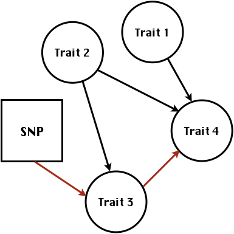

```{r setup, include=FALSE}
options(htmltools.dir.version = FALSE)

#library(plotly)
#library(tidyverse)
#library(htmlwidgets)
```


# About me 


---
# Multivariate traits


- Multi-trait GWAS (MTM-GWAS)

- Structural equation model GWAS (SEM-GWAS)


---
# Multi-trait model 
$$
\begin{align*}
  \mathbf{y} &= \mathbf{Xb} + \mathbf{Zu} + \mathbf{e}  \\
  \begin{bmatrix}
    \mathbf{y_1} \\
    \mathbf{y_2} \\
    \vdots \\
    \mathbf{y_n} \\
  \end{bmatrix} &=
  \begin{bmatrix}
    \mathbf{X_1} & 0 & \cdots & 0 \\
    0 & \mathbf{X_2} & \cdots  & 0\\
    \vdots & \vdots &  & \vdots \\
    0 & 0 & \cdots  & \mathbf{X_n} \\
  \end{bmatrix} 
  \begin{bmatrix}
    \mathbf{b_1} \\
    \mathbf{b_2} \\
    \vdots \\
    \mathbf{b_n} 
  \end{bmatrix} \\ &+
  \begin{bmatrix}
    \mathbf{Z_1} & 0 & \cdots & 0 \\
    0 & \mathbf{Z_2} & \cdots  & 0\\
    \vdots & \vdots &  & \vdots \\
    0 & 0 & \cdots  & \mathbf{Z_n} \\
  \end{bmatrix}
  \begin{bmatrix}
    \mathbf{u_1} \\
    \mathbf{u_2} \\
    \vdots \\
    \mathbf{u_n} 
  \end{bmatrix} +
  \begin{bmatrix}
    \mathbf{e_1} \\
    \mathbf{e_2} \\
    \vdots \\
    \mathbf{e_n} 
  \end{bmatrix} \\
   E\begin{pmatrix}
  \mathbf{u} \\
  \mathbf{e}
  \end{pmatrix} &=
  \begin{bmatrix}
    0 \\
    0
  \end{bmatrix} \\
  Var\begin{pmatrix}
  \mathbf{u} \\
  \mathbf{e}
  \end{pmatrix} &=
  \begin{bmatrix}
    \mathbf{\Sigma^2_{g}} \otimes \mathbf{G} & 0 \\
    0 & \mathbf{\Sigma^2_e} \otimes \mathbf{I}
  \end{bmatrix}
\end{align*}
$$


---
# Multi-trait model (t = 2)
$$
\begin{align*}
\mathbf{\Sigma^2_{g}} &=
  \begin{bmatrix}
    \mathbf{\Sigma^2_{g_{1}}}  & \mathbf{\Sigma^2_{g_{12}}} \\
    \mathbf{\Sigma^2_{g_{21}}} & \mathbf{\Sigma^2_{g_{2}}} 
  \end{bmatrix} \\
  \mathbf{\Sigma^2_{e}} &=
  \begin{bmatrix}
    \mathbf{\Sigma^2_{e_{1}}}  & \mathbf{\Sigma^2_{e_{12}}} \\
    \mathbf{\Sigma^2_{e_{21}}} & \mathbf{\Sigma^2_{e_{2}}} 
  \end{bmatrix} \\
  \mathbf{\Sigma^2_{g}} \otimes \mathbf{G} &= 
  \begin{bmatrix}
    \mathbf{\Sigma^2_{g_{1}}} \mathbf{G}  & \mathbf{\Sigma^2_{g_{12}}} \mathbf{G}  \\
    \mathbf{\Sigma^2_{g_{21}}} \mathbf{G}  & \mathbf{\Sigma^2_{g_{2}}}  \mathbf{G} 
  \end{bmatrix} \\
   \mathbf{\Sigma^2_{e}} \otimes \mathbf{I} &= 
  \begin{bmatrix}
    \mathbf{\Sigma^2_{e_{1}}} \mathbf{I}  & \mathbf{\Sigma^2_{e_{12}}} \mathbf{I}  \\
    \mathbf{\Sigma^2_{e_{21}}} \mathbf{I}  & \mathbf{\Sigma^2_{e_{2}}}  \mathbf{I} 
  \end{bmatrix} \\
\end{align*}
$$


---
# Multi-trait GBLUP model 
$$\mathbf{y_{1} = X_{1}b_{1} + Z_{1}u_{1} + e_{1}}$$
$$\mathbf{y_{2} = X_{2}b_{2} + Z_{2}u_{2} + e_{2}}$$


Individuals within traits 


---
# Is multi-trait model useful?

- increase statistical power to detect QTL regions 

- estimate covariance structures $\rightarrow$ genetic correlations

- traits with scarce records 

- traits with low heritability


---
# MTM-GWAS (Single-marker linear mixed model)


---
# Multiple-trait GWAS (MTM-GWAS)


---
# Interrelationships among traits 


1. Biological prior 
    - previous experiments
    - literature

2. Infer from the data


---
# Bayesian Network
Probabilistic directed acyclic graphical model
    - interrelationship (Edges) among latent variables (Nodes)
    - genetic selection for breeding requires causal assumptions

<div align="center"> 

</div>


---
# Constraint-based learning


---
# Score-based learning


---
# Examples of algorithms
Score-based algorithm

- Hill climbing
- Tabu search

Hybrid algorithm

- Max-Min Hill Climbing algorithm
- General 2-Phase Restricted Maximization algorithm


---
# References

[10.1534/g3.119.400154](https://doi.org/10.1534/g3.119.400154)


[10.1002/pld3.304](https://doi.org/10.1002/pld3.304)


---
# Phenotypic,  genetic, and residual networks


---
# Leveraging phenotypic networks to study multiple traits


---
# Leveraging phenotypic networks to study multiple traits


---
# Introducing SEM into the GWAS framework


---
# Structural equation model GWAS (SEM-GWAS)
Direct effect of SNP on Trait 4


---
# SEM-GWAS
Indirect effect of SNP on Trait 4 through Trait 1 (1)


---
# SEM-GWAS
Indirect effect of SNP on Trait 4 through Trait 2 (2)


---
# SEM-GWAS
Indirect effect of SNP on Trait 4 through Trait 2 & 3 (3)


---
# SEM-GWAS
Indirect effect of SNP on Trait 4 through Trait 3 (4)



---
# SEM-GWAS vs. MTM-GWAS
Effect of SNP on Trait 4


\begin{align*}
     \text{Effect of SNP (MTM-GWAS)} &\approx \text{Overall effect (SEM-GWAS)}\\
     &= \text{Direct effect (SEM-GWAS)} \\
     &+ \text{Indirect effect (SEM-GWAS)} 
\end{align*}


---
# How to fit SEM-GWAS?

1. Fit MTM and decompose phenotypes into genetics and residuals

2. Infer the network structure of traits

3. Fit SEM-GWAS given the network structure


---
# Leveraging phenotypic networks to study multiple traits


---
# Leveraging phenotypic networks to study multiple traits


.pull-left[
- Shoot biomass (projected shoot area, PSA)
- Root biomass (RB)
]

.pull-right[
- Water use (WU)
- Water use efficiency (WUE)
]

How are these traits related?

---
# Projected shoot area


---
# Rice data

- Drought data
- Rice diversity panel
    - Projected shoot area
    - Root biomass
    - Water use efficiency
    - Water use
  
Inferred trait network structure


---
# Bayesian networks
.pull-left[

]

.pull-right[
- BN based on 500 bootstrap samples

- % above edges indicate percentage of bootstrap networks with the given edge

- Numbers in parenthesis indicate the proportion of bootstrap networks with the given edge direction
]


---
# Bayesian networks
.pull-left[

]

.pull-right[
- Phenotypic values for WUE are dependant on phenotypes for RB and PSA

- Phenotypic values for WU are dependant on phenotypes for PSA
]


---
# How to fit SEM-GWAS?
\begin{align*}
\mathbf{y} =\boldsymbol{\Lambda}  \mathbf{y} + \mathbf{ws} + \mathbf{Zg} + \boldsymbol{\epsilon}
\end{align*}


---
# Inferred trait network structure


---
# Structural equation model


---
# Bayesian information criterion


---
# Structural coefficients


---
# Projected shoot area
\begin{align*}
\text{Direct}_{s_j \rightarrow y_{1_{\text{PSA}}}} &= s_{j(y_{1_{\text{PSA}}})} \\
\text{Total}_{s_j \rightarrow y_{1_{\text{PSA}}}} &= \text{Direct}_{s_j \rightarrow y_{1_{\text{PSA}}}}\\
&= s_{j(y_{1_{\text{PSA}}})}
\end{align*}


---
# Root biomass
\begin{align*}
\text{Direct}_{s_j \rightarrow y_{2_{\text{RB}}}} &=s_{j(y_{2_{\text{RB}}})} \\
\text{Total}_{s_j \rightarrow y_{2_{\text{RB}}}} &= \text{Direct}_{s_j \rightarrow y_{2_{\text{RB}}}}\\
&= s_{j(y_{2_{\text{RB}}})}
\end{align*}
  


---
# Water use
\begin{align*}
\text{Direct}_{s_j \rightarrow y_{3_{\text{WU}}}} &=s_{j(y_{3_{\text{WU}}})} \\
\text{Indirect}_{s_j \rightarrow y_{3_{\text{WU}}}} &= \lambda_{13}s_{j(y_{1_{\text{PSA}}})} \\
\text{Total}_{s_j \rightarrow y_{3_{\text{WU}}}} &= \text{Direct}_{s_j \rightarrow y_{3_{\text{WU}}}} + \text{Indirect}_{s_j \rightarrow y_{3_{\text{WU}}}} \\
&= s_{j(y_{3_{\text{WU}}})} + \lambda_{13}s_{j(y_{1_{\text{PSA}}})}
\end{align*}


---
# Water use efficiency
\begin{align*}
\text{Direct}_{s_j \rightarrow y_{4_{\text{WUE}}}} &=s_{j(y_{4_{\text{WUE}}})} \\
\text{Indirect(1)}_{s_j \rightarrow y_{4_{\text{WUE}}}} &= \lambda_{14}s_{j(y_{1_{\text{PSA}}})} \\
\text{Indirect(2)}_{s_j \rightarrow y_{4_{\text{WUE}}}} &= \lambda_{24}s_{j(y_{2_{\text{RB}}})} \\
\text{Total}_{S_j \rightarrow y_{4_{\text{WUE}}}} &= \text{Direct}_{s_j \rightarrow y_{4_{\text{WUE}}}} + \text{Indirect(1)}_{s_j \rightarrow y_{4_{\text{WUE}}}} + \text{Indirect(2)}_{s_j \rightarrow y_{4_{\text{WUE}}}} \\ 
&= s_{j(y_{4_{\text{WUE}}})} + \lambda_{14}s_{j(y_{1_{\text{PSA}}})} + \lambda_{24}s_{j(y_{2_{\text{RB}}})}
\end{align*}


---
# Water use efficiency


---
# Assumption about marker effects

- BLUP assumes normally distributed QTL / marker effects

- Does not match the prior information regarding the distributions of QTL / marker effects for some traits

- What if we want to assume QTL / markers have non-Gaussian distribution?


---
# BayesRR (ridge regression)
\begin{align*}
    \mathbf{y} = \sum^m_{j=1} \mathbf{W}_{j} a_j + \epsilon
    \rightarrow \mathbf{y}| a_j, \sigma^2_e \sim N(\mathbf{W}_{j} a_j, \sigma^2_e)
\end{align*}
  
$p(\mathbf{a}| \mathbf{y}, \sigma^2_e, \sigma^2_{a}) \propto p(\mathbf{y}|\mathbf{a}, \sigma^2_e) \cdot p(\mathbf{a}| \sigma^2_{a})$

\begin{align*}
        \text{Prior distributions}
    \begin{cases}
          a_j|\sigma^2_{a} \sim N(0,  \sigma_{a}^{2} ) \\
          \sigma^2_{a} \sim \chi^{-2}(\nu, S)  \\
          \sigma^2_{e} \sim \chi^{-2}(\nu, S)
    \end{cases}
\end{align*}

- $\chi^{-2}(\nu, S) \rightarrow$ scaled inverted chi-square distribution with $\nu$ degrees of freedom  and scale parameter $S$ 


---
# BayesL (Lasso)

\begin{align*}
    \mathbf{y} = \sum^m_{j=1} \mathbf{W}_{j} a_j + \epsilon
    \rightarrow \mathbf{y}| a_j, \sigma^2_e \sim N(\mathbf{W}_{j} a_j, \sigma^2_e)
\end{align*}

$p(\mathbf{a}| \mathbf{y}, \sigma^2_e, \sigma^2_{a}) \propto p(\mathbf{y}|\mathbf{a}, \sigma^2_e) \cdot p(\mathbf{a}| \sigma^2_{a})$

\begin{align*}
\text{Prior distributions}
    \begin{cases}
          a_j|\sigma^2_{a_j} \sim N(0,  \sigma_{a_j}^{2} ) \\
          \sigma^2_{a_j} \sim Exponential(\lambda)  \\
          \sigma^2_{e} \sim \chi^{-2}(\nu, S)
    \end{cases}
\end{align*}


---
# BayesA
\begin{align*}
    \mathbf{y} = \sum^m_{j=1} \mathbf{W}_{j} a_j + \epsilon
    \rightarrow \mathbf{y}| a_j, \sigma^2_e \sim N(\mathbf{W}_{j} a_j, \sigma^2_e)
\end{align*}

$p(\mathbf{a}| \mathbf{y}, \sigma^2_e, \sigma^2_{a}) \propto p(\mathbf{y}|\mathbf{a}, \sigma^2_e) \cdot p(\mathbf{a}| \sigma^2_{a})$

\begin{align*}
        \text{Prior distributions}
    \begin{cases}
          a_j|\sigma^2_{a_j} \sim N(0,  \sigma_{a_j}^{2} ) \\
          \sigma^2_{a_j} \sim \chi^{-2}(\nu, S)  \\
          \sigma^2_{e} \sim \chi^{-2}(\nu, S)
    \end{cases}
\end{align*}

- $\chi^{-2}(\nu, S) \rightarrow$ scaled inverted chi-square distribution with $\nu$ degrees of freedom  and scale parameter $S$ 


---
# BayesB
\begin{align*}
    \mathbf{y} = \sum^m_{j=1} \mathbf{W}_{j} a_j + \epsilon
    \rightarrow \mathbf{y}| a_j, \sigma^2_e \sim N(\mathbf{W}_{j} a_j, \sigma^2_e)
\end{align*}

$p(\mathbf{a}| \mathbf{y}, \sigma^2_e, \sigma^2_{a}) \propto p(\mathbf{y}|\mathbf{a}, \sigma^2_e) \cdot p(\mathbf{a}| \sigma^2_{a})$

\begin{align*}
        \text{Prior distributions}
    \begin{cases}
          a_j|\sigma^2_{a_j} \sim N(0,  \sigma_{a_j}^{2} ) \\
          \begin{cases}
            \sigma^2_{a_j} = 0  \quad \text{with probability} \quad \pi\\
            \sigma^2_{a_j} \sim  \chi^{-2}(\nu, S) \quad \text{with probability} \quad (1 - \pi)
          \end{cases} \\
          \sigma^2_{e} \sim \chi^{-2}(\nu, S)
    \end{cases}
\end{align*}

- $\pi$: probability that markers have no effect

- $\chi^{-2}(\nu, S) \rightarrow$ scaled inverted chi-square distribution with $\nu$ degrees of freedom  and scale parameter $S$ 


---
# BayesB* (modified version)
\begin{align*}
    \mathbf{y} = \sum^m_{j=1} \mathbf{W}_{j} a_j + \epsilon
    \rightarrow \mathbf{y}| a_j, \sigma^2_e \sim N(\mathbf{W}_{j} a_j, \sigma^2_e)
\end{align*}

$p(\mathbf{a}| \mathbf{y}, \sigma^2_e, \sigma^2_{a}) \propto p(\mathbf{y}|\mathbf{a}, \sigma^2_e) \cdot p(\mathbf{a}| \sigma^2_{a})$

\begin{align*}
        \text{Prior distributions}
        \begin{cases}
           \begin{cases}
                       a_j =  0  \quad \text{with probability} \quad  \pi  \\
                       a_j|\sigma^2_{a_j} \sim N(0,  \sigma_{a_j}^{2} )  \quad \text{with probability} \quad (1 - \pi)
           \end{cases} \\
           \sigma^2_{a_j} \sim  \chi^{-2}(\nu, S)  \\
          \sigma^2_{e} \sim \chi^{-2}(\nu, S)
    \end{cases}
\end{align*}

- $\pi$: probability that markers have no effect

- $\chi^{-2}(\nu, S) \rightarrow$ scaled inverted chi-square distribution with $\nu$ degrees of freedom  and scale parameter $S$ 


---
# BayesB** (modified version)
\begin{align*}
    \mathbf{y} = \sum^m_{j=1} \mathbf{W}_{j} a_j + \epsilon
    \rightarrow \mathbf{y}| a_j, \sigma^2_e \sim N(\mathbf{W}_{j} a_j, \sigma^2_e)
\end{align*}

$p(\mathbf{a}| \mathbf{y}, \sigma^2_e, \sigma^2_{a}) \propto p(\mathbf{y}|\mathbf{a}, \sigma^2_e) \cdot p(\mathbf{a}| \sigma^2_{a})$

\begin{align*}
        \text{Prior distributions}
        \begin{cases}
           \begin{cases}
                       a_j|\sigma^2_{a_j} \sim N(0,  \sigma_{a_j}^{2} \approx 0)  \quad \text{with probability} \quad  \pi  \\
                       a_j|\sigma^2_{a_j} \sim N(0,  \sigma_{a_j}^{2} )  \quad \text{with probability} \quad (1 - \pi)
           \end{cases} \\
           \sigma^2_{a_j} \sim  \chi^{-2}(\nu, S)  \\
          \sigma^2_{e} \sim \chi^{-2}(\nu, S)
    \end{cases}
\end{align*}

- $\pi$: probability that markers have no effect

- $\chi^{-2}(\nu, S) \rightarrow$ scaled inverted chi-square distribution with $\nu$ degrees of freedom  and scale parameter $S$ 


---
# BayesCpi
\begin{align*}
    \mathbf{y} = \sum^m_{j=1} \mathbf{W}_{j} a_j + \epsilon
    \rightarrow \mathbf{y}| a_j, \sigma^2_e \sim N(\mathbf{W}_{j} a_j, \sigma^2_e)
\end{align*}

$p(\mathbf{a}| \mathbf{y}, \sigma^2_e, \sigma^2_{a}) \propto p(\mathbf{y}|\mathbf{a}, \sigma^2_e) \cdot p(\mathbf{a}| \sigma^2_{a})$

\begin{align*}
        \text{Prior distributions}
        \begin{cases}
           \begin{cases}
                       a_j = 0  \quad \text{with probability} \quad  \pi  \\
                       a_j|\sigma^2_{a} \sim N(0,  \sigma_{a}^{2} )  \quad \text{with probability} \quad (1 - \pi)
           \end{cases} \\
           \pi \sim Uniform(0,1) \\
           \sigma^2_{a} \sim  \chi^{-2}(\nu, S)  \\
          \sigma^2_{e} \sim \chi^{-2}(\nu, S)
    \end{cases}
\end{align*}

- $\pi$: probability that markers have no effect

- $\chi^{-2}(\nu, S) \rightarrow$ scaled inverted chi-square distribution with $\nu$ degrees of freedom  and scale parameter $S$ 


---
# BayesC
\begin{align*}
    \mathbf{y} = \sum^m_{j=1} \mathbf{W}_{j} a_j + \epsilon
    \rightarrow \mathbf{y}| a_j, \sigma^2_e \sim N(\mathbf{W}_{j} a_j, \sigma^2_e)
\end{align*}

$p(\mathbf{a}| \mathbf{y}, \sigma^2_e, \sigma^2_{a}) \propto p(\mathbf{y}|\mathbf{a}, \sigma^2_e) \cdot p(\mathbf{a}| \sigma^2_{a})$

\begin{align*}
        \text{Prior distributions}
        \begin{cases}
           \begin{cases}
                       a_j = 0  \quad \text{with probability} \quad  \pi  \\
                       a_j|\sigma^2_{a} \sim N(0,  \sigma_{a}^{2} )  \quad \text{with probability} \quad (1 - \pi)
           \end{cases} \\
           \sigma^2_{a} \sim  \chi^{-2}(\nu, S)  \\
          \sigma^2_{e} \sim \chi^{-2}(\nu, S)
    \end{cases}
\end{align*}

- $\pi$: probability that markers have no effect

- $\chi^{-2}(\nu, S) \rightarrow$ scaled inverted chi-square distribution with $\nu$ degrees of freedom  and scale parameter $S$ 


---
# Prior densities ([de los Campos et al., 2012](https://doi.org/10.1534/genetics.112.143313))


.pull-left[
- Bayes RR (ridge regression)
- BayesL (LASSO)
- BayesA
- BayesB
]


.pull-right[
- BayesB*
- BayesB**
- BayesC
- BayesCpi
]


---
# Bayesian marker effect SEM 

- $\mathbf{\alpha_j} = \mathbf{D_j B_j}$ 
- $\mathbf{D_j}$: diagonal matrix including the indicator variable indicating whether the marker effect of locus j for trait k is zero or not
- $\mathbf{B_j}$: a priori assumed to be independently and identically distributed multivariate normal vectors


- $\boldsymbol{\lambda}$: non-zero elements in $\boldsymbol{\Lambda}$


---
# Distribution for $\lambda$
<small>Prior </small>


<small>Full conditional </small>


- $\lambda_0 = 0$, $\tau = 1$, and $\mathbf{R}$ is the residual covariance matrix


---
# Real rice data


---
# Real rice data - Resutls


---
# Reference

[10.1534/g3.120.401618](https://doi.org/10.1534/g3.120.401618)


---
# Implementation of Bayesian marker effect SEM-GWAS

[https://reworkhow.github.io/JWAS.jl/latest/](https://reworkhow.github.io/JWAS.jl/latest/)

You can fit BayesA SEM-GWAS, BayesB SEM-GWAS, BayesCpi SEM-GWAS, etc.!
    
---
# Conclusions for SEM-GWAS
- Relatively simple approach to understand how QTL affect multiple traits

- Provides novel insights compared to conventional multi-trait GWAS approaches


